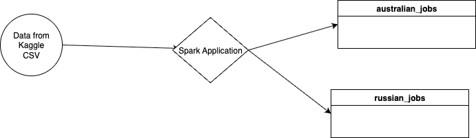

# Final project for Spark Developer Course
    Chosen topic for the project - Построение аналитических витрин данных IT вакансий
## Navigation: 
* `Main Job` - the main Spark job which is aimed to process source data and load it into Results
* `Job Trait`- provides separate function for column renaming of DF or DS
* `Source data` - the data that aimed to be processed
* `Result data` - the result of main Spark job which is storing in Parquet
* `Helper` - the supportive Scala class which provides an interface for creating SparkContext(Session), reading & writing almost any files using configs

## Content:
* `Main Job`: src/main/scala/final_spark_project/WorldwideVacanciesETL.scala
* `Job Trait`: src/main/scala/final_spark_project/StageProcessor.scala
* `Source data`: src/main/resources/source_data
* `Result data in Parquet`: src/main/resources/results
* `Helpers`: src/main/scala/common/base_processor.scala

## Sources: 
* Russian Vacancies - https://www.kaggle.com/datasets/pavfedotov/heaadhunter-vacancies
* Australian Vacancies - https://www.kaggle.com/datasets/techsalerator/job-posting-data-in-austria

## Solution Design:
